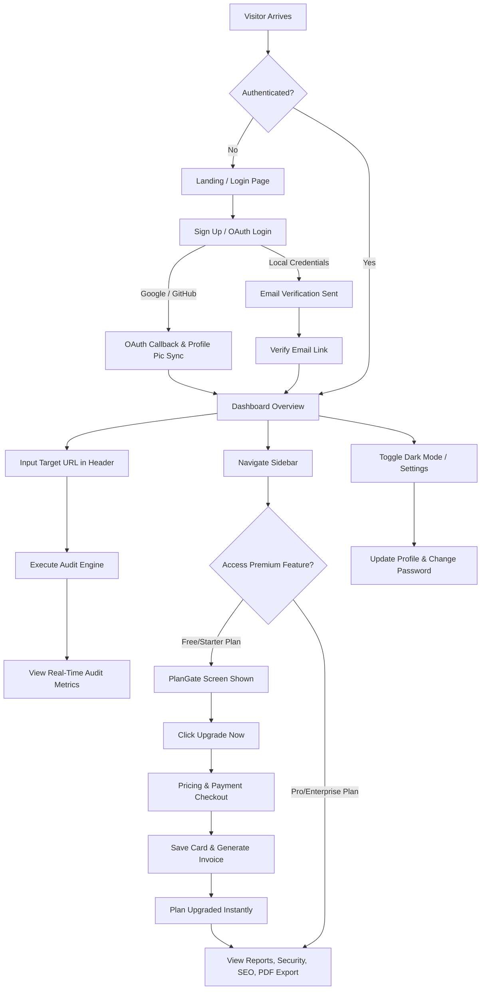

# Site Pilot — Technical Specification & Feature Documentation

> **Site Pilot** is an AI-powered SaaS web application designed for real-time website performance auditing, SEO analysis, security vulnerability scanning, mobile usability testing, and automated PDF report generation.

---

## 1. Executive Summary

Site Pilot provides website owners, developers, and agency teams with automated audit metrics, Core Web Vitals history tracking, AI-driven fix recommendations, and interactive AI chat assistance. It features a multi-tenant tier subscription model (Free, Starter, Pro, Enterprise), dynamic payment & billing history, dark mode engine, OAuth authentication (Google & GitHub), and automated feature gating for premium tools.

---

## 2. Technology Stack & Architecture

### Core Framework & Runtime
- **Framework**: Next.js 16 (App Router)
- **Runtime**: React 19 & Node.js
- **Language**: TypeScript 5 (Strict Type Safety)

### Frontend & UI Styling
- **Styling**: Vanilla CSS with Tailwind CSS v4 & custom `@theme` / `@custom-variant dark` tokens
- **Design System**: Glassmorphism (blurs, sleek border glows, dark slate `#080c14` / `#0f172a` canvas)
- **Component Utilities**: `clsx`, `tailwind-merge`, `class-variance-authority`
- **Iconography**: Lucide React (`lucide-react`)
- **Animations**: Framer Motion (`framer-motion`)
- **Data Visualization**: Recharts (`recharts`) for Core Web Vitals time-series charts & score gauges
- **Notifications**: Sonner (`sonner`) toast notifications

### State Management & Data Fetching
- **State Management**: Redux Toolkit (`@reduxjs/toolkit`) with React-Redux (`react-redux`)
- **Async Operations**: Redux Async Thunks & React Hooks
- **Query Caching**: TanStack React Query (`@tanstack/react-query`)

### Backend Services & Database
- **Database**: MongoDB Atlas
- **ORM / ODM**: Mongoose 9 (`mongoose`)
- **Authentication**: NextAuth.js v4 (`next-auth`)
  - **OAuth Providers**: Google OAuth 2.0 & GitHub OAuth
  - **Local Credentials**: Custom JWT tokens (Access & Refresh) stored in HTTP-Only Secure Cookies
  - **Password Hashing**: Bcrypt (`bcryptjs`)
- **Transactional Emails**: Nodemailer (`nodemailer`) for email verification and password resets

### Audit Engine & Media Services
- **Audit Engine**: Custom HTML/SEO parser (`src/lib/audit-engine.ts`) analyzing headers, Open Graph tags, Core Web Vitals, image responsiveness, and SSL security.
- **Website Mockup Captures**: Real-time website screenshot renderer via `image.thum.io`.

---

## 3. Comprehensive Features List

### 🔑 Authentication & Identity Management
- **Multi-Provider Login**: Local Email/Password, Google OAuth 2.0, and GitHub OAuth.
- **Profile Picture Synchronization**: Automatically fetches, stores, and displays Google & GitHub avatar photos in the header dropdown, sidebar, and settings page with provider badges (`Google Login`, `GitHub Login`).
- **Email Verification**: Tokenized link verification for newly registered local accounts via Nodemailer.
- **Password Reset & Recovery**: Forgot Password & Tokenized Reset Password flow.
- **Demo & Admin Seeding**: Pre-configured admin and demo account seeding endpoints for rapid testing (`/api/auth/seed-demo`, `/api/auth/seed-admin`).

### 📊 Real-Time Website Audit Engine
- **Instant Domain Scanner**: Accepts any URL, cleans domain parameters, executes multi-category audits (Performance, SEO, Security, Accessibility, Mobile usability), and stores comprehensive audit reports.
- **Core Web Vitals Tracking**: Time-series charts tracking LCP (Largest Contentful Paint), CLS (Cumulative Layout Shift), and FCP (First Contentful Paint) over 7-day and 30-day periods.
- **Live Screenshot Preview**: Displays high-definition mockups of target audited sites.

### 💳 Subscriptions, Pricing Plans & Feature Gating
- **Tiered Plans**:
  - **Free Plan** ($0/forever): Allows auditing 1 website, basic score overview.
  - **Starter Plan** ($19/mo): Allows auditing up to 3 websites.
  - **Professional Plan** ($49/mo): Allows auditing up to 15 websites, full AI recommendations & PDF exports.
  - **Enterprise Plan** ($199/mo): Unlimited website audits, priority scanning, dedicated API access.
- **Automated Feature Gating**: `<PlanGate requiredPlan="pro">` protects premium modules (`/reports`, `/security`, `/performance`, `/seo`, `/mobile`, `/pdf-reports`) for Free and Starter plan users with an intuitive locked card overlay leading to upgrade.
- **Website Limit Enforcement & Card Masking**: Limits total monitored sites based on active plan (Free: 1, Starter: 3, Pro: 15, Enterprise: Unlimited). Excess sites beyond active limit render as masked/disabled with lock badges.

### 💳 Dynamic Billing & Checkout
- **Instant Payment Gateway**: Realistic credit card payment modal (`/payment`) saving card brand, name, last 4 digits, and expiry to `localStorage` (`payment_method`).
- **Dynamic Invoices**: Generates timestamped receipt statements for paid plan upgrades (`user_invoices`), with a clean empty state ("No Paid Statements") for Free plan users.
- **Instant Plan Synchronization**: Upgrading immediately syncs Redux state, LocalStorage, and UI access permissions without full page reloads.

### 🤖 AI Intelligence & Audit Assistant
- **AI Recommendations Panel**: Displays actionable code snippets, fix instructions, impact levels (High/Medium/Low), and category filters.
- **Floating AI Audit Assistant**: Interactive drawer widget (`/api/ai/chat`) allowing users to ask domain-specific optimization questions with streamed response simulation.

### 🌗 Dark Mode Engine
- **Class-Based Dark Mode**: Synchronized via `html.classList.contains('dark')` and LocalStorage (`theme`).
- **Zero-Flicker Script**: Inline `<script>` injected in `<head>` preventing white flash on page reload.
- **Dark Slate Aesthetic**: Rich dark slate background (`#080c14` / `#0f172a`) with glowing glass cards (`dark:bg-slate-900/85`) and high-contrast typography.

### 📄 PDF Report Generator
- **Interactive PDF Preview**: Formatted print paper view featuring custom website headers, category score breakdown, issue lists, visual screenshot cards, and automated browser print/PDF export.

---

## 4. End-to-End User Flow

### Key Journey Breakdown

1. **User Onboarding & Authentication**:
   - User navigates to `/login` or `/signup`.
   - Option A: Log in via Google or GitHub. OAuth callback creates or retrieves user record, syncs avatar photo, generates JWT cookies, and redirects to Dashboard.
   - Option B: Register with Email & Password. Verification email sent via Nodemailer; clicking link activates account.

2. **Auditing & Monitoring**:
   - User inputs domain URL (e.g., `https://example.com`) in global header search bar.
   - System verifies active plan limit (Free: 1, Starter: 3, Pro: 15, Enterprise: ∞).
   - If within limit, runs real-time audit engine, computes scores (Performance, SEO, Security, Accessibility, Mobile), generates Core Web Vitals chart, and displays live website thumbnail.

3. **Plan Upgrade & Feature Access**:
   - User attempts to access a protected route (e.g., `/pdf-reports`).
   - If user is on Free or Starter plan, `<PlanGate>` displays locked overlay explaining required tier.
   - Clicking "Upgrade Now" routes to `/upgrade` (Pricing) -> `/payment`.
   - User completes payment; card info is saved to `localStorage`, receipt invoice is generated, plan updates to `pro` or `enterprise`, and all locked routes immediately unlock.

4. **Settings & Dark Mode Management**:
   - User clicks Dark Mode toggle in header or settings page (`/settings`).
   - Theme immediately switches site to sleek dark slate design (`#080c14`), persisting preference in `localStorage`.
   - Settings page displays avatar banner, name, email, OAuth badge, and security password update form.

---

## 5. Database Schema Specifications

### User Model (`src/models/user.model.ts`)
| Field | Type | Description |
|---|---|---|
| `email` | String (Unique) | User primary email address |
| `password` | String | Bcrypt hashed password (empty for OAuth) |
| `name` | String | User full display name |
| `firstName` | String | First name |
| `lastName` | String | Last name |
| `image` | String | OAuth avatar URL / Profile picture |
| `profileImage` | String | Profile picture URL |
| `avatar` | String | Secondary avatar fallback URL |
| `provider` | String | `"local"` \| `"google"` \| `"github"` |
| `role` | String | `"user"` \| `"admin"` |
| `plan` | String | `"free"` \| `"starter"` \| `"pro"` \| `"enterprise"` |
| `status` | String | `"active"` \| `"inactive"` |
| `isEmailVerified` | Boolean | Account verification status |

### Audit Report Model (`src/models/audit-report.model.ts`)
| Field | Type | Description |
|---|---|---|
| `userId` | ObjectId | Reference to User document |
| `url` | String | Target audited website URL |
| `domain` | String | Extracted domain name |
| `overallScore` | Number | Composite audit score (0-100) |
| `performanceScore` | Number | Performance category score (0-100) |
| `seoScore` | Number | SEO category score (0-100) |
| `securityScore` | Number | Security category score (0-100) |
| `accessibilityScore` | Number | Accessibility category score (0-100) |
| `mobileScore` | Number | Mobile usability category score (0-100) |
| `issues` | Array | Discovered audit issue objects |
| `recommendations` | Array | AI optimization recommendations |
| `chartData` | Array | LCP, CLS, FCP time-series data points |
| `screenshotUrl` | String | Live site screenshot mockup URL |
| `createdAt` | Date | Timestamp of scan execution |

---

## 6. API Endpoint Directory

### Authentication Endpoints (`/api/auth`)
- `POST /api/auth/register` — Local account registration
- `POST /api/auth/login` — Local email/password login & JWT cookie issue
- `POST /api/auth/logout` — Clear auth cookies & terminate session
- `GET /api/auth/me` — Retrieve active authenticated user session & profile image
- `GET /api/auth/[...nextauth]` — NextAuth OAuth handler (Google & GitHub)
- `POST /api/auth/forgot-password` — Dispatch password reset email
- `POST /api/auth/reset-password` — Process password reset token
- `POST /api/auth/change-password` — Update user password

### Audit Endpoints (`/api/audit`)
- `GET /api/audit` — Fetch user audit reports history
- `POST /api/audit` — Execute new real-time website audit
- `DELETE /api/audit/[id]` — Delete audit report record

### AI Endpoints (`/api/ai`)
- `POST /api/ai/chat` — Interactive AI Audit Assistant chat stream
